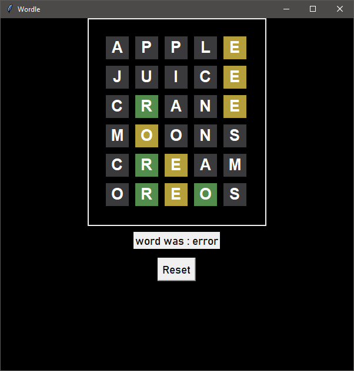

# Wordle

- [Features](#Features)
- [About The Project](#About-The-Project)
- [Dependencies](#dependencies)
- [Files](#files)
## Features
* Ability to reset the game
* Play infinite amount of times (unlike the original)
* easily customize with python3 and tkinter
* ability to turn into exe file
## About The Project
Wordle is a word puzzle game that challenges players to guess a secret five-letter word within six attempts. After each guess, the player receives feedback on which letters are correct and in the right position (highlighted in green), which letters are correct but in the wrong position (highlighted in yellow), and which letters are not in the word at all. It's a delightful mix of deduction and vocabulary skills, making each attempt a step closer to unraveling the mystery word.
## Preview

## Dependencies
the dependencies of this project are :
* python3
* tkinter
* pycharm
## Files
* Block.py - a file for the class block, the purpose of this class is to draw every square with character
* Functions.py - a file for storing utility functions which are used in the program
* Word.py - a file for class word, which is existing for managing the attempts in a more simplified way
* main.py - main python file for running the program
* words.txt - all of the words used by the program (words that are used for the game)